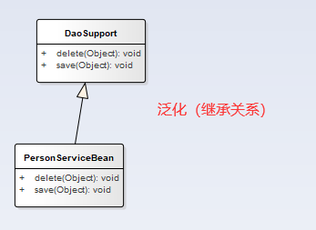
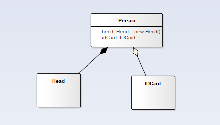

##### 依赖
```text
只要一个类中用到了另一个类，那么就存在依赖关系。
```

##### 泛化
```text
泛化可以说是继承，是依赖关系的一种特例。
```

##### 实现
```text
接口实现
```

##### 关联关系
```text
单项关联关系；双向关联关系；即一对一
```

##### 聚合关系
```text
整体对部分的关系，且整体和部分可以分开（不可以分开是组合关系，例如成员变量创建整体对象的时候，成员变量也new了，那么就是不可分离的），聚合关系是关联关系的一种特例
```

##### 组合关系
```text
整体和部分的关系，整体和部分不可以分开。如果程序里面级联删除的话，那么两者就又是组合关系了。
```

```text
综合例子：组合-聚合的
```

